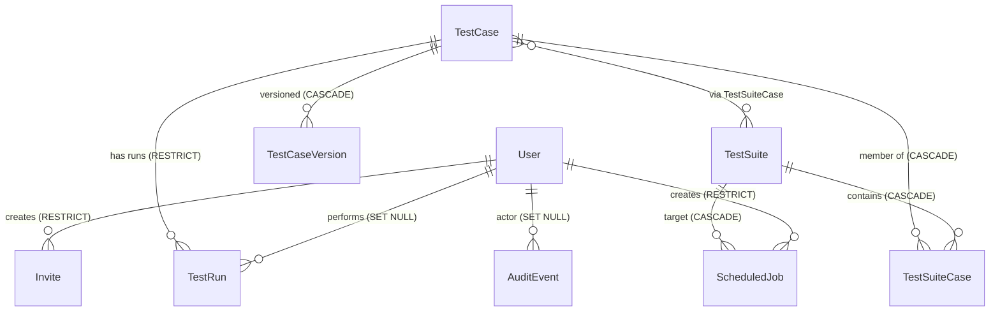

# Regress — Defense Analysis

> **Project:** Regress (test-case-manager) — a self-contained test-management platform
> **Author:** Kripesh Parajuli · MIT License
> **Audience:** CS final-year defense panel
> **Repository under analysis:** `/home/kripesh/projects/test-case-manager`

---

## Table of Contents

1. [Executive summary](#1-executive-summary)
2. [Problem statement & motivation](#2-problem-statement--motivation)
3. [Objectives & scope](#3-objectives--scope)
4. [Tech stack & rationale](#4-tech-stack--rationale)
5. [System architecture](#5-system-overview)
6. [Backend implementation](#6-backend-implementation)
7. [Frontend implementation](#7-frontend-implementation)
8. [Database design](#8-database-design)
9. [Eight cross-cutting mechanisms (deep dive)](#9-eight-cross-cutting-mechanisms)
10. [Testing & quality assurance](#10-testing--quality-assurance)
11. [Operations & deployment](#11-operations--deployment)
12. [Documentation as a deliverable](#12-documentation-as-a-deliverable)
13. [Honest limitations & known issues](#13-honest-limitations--known-issues)
14. [Defense talking points](#14-defense-talking-points)
15. [Anticipated panel questions & prepared answers](#15-anticipated-panel-questions--prepared-answers)
16. [Future work](#16-future-work)
17. [Conclusion](#17-conclusion)

---

## 1. Executive summary

Regress is a full-stack test-management platform that covers the **complete** QA workflow — not just CRUD. It exposes test cases, suites, runs, version history, flakiness detection, scheduled jobs, role-based access control (RBAC), audit logging, and (in its latest phase) real Cypress test execution with live streaming. The codebase is deliberately written so that the same domain is reachable at three layers (curl, Postman, Cypress) and so that every cross-cutting mechanism has its own module *and* its own documentation page.

| Aspect | Quantitative measure |
|---|---|
| Languages | JavaScript (server, ES2022), TypeScript (client, strict mode, no `any`) |
| Backend files | 1 entry (`index.js`) + 12 route files + 7 middleware + 13 utils + 6 Zod schemas |
| Frontend files | React 19 SPA, 12 feature folders, 11 shared components, 8 hooks/lib |
| Database | PostgreSQL 16 via Prisma 5; 8 models, 4 migrations |
| Tests | 218 Cypress tests (129 API + 83 UI + 6 advanced-patterns) across 24 spec files; plus 80 Node `node:test` unit cases (298 total) |
| Documentation | 18 docs/ markdown files, 2,786 lines, ~88 KB; plus 419-line README |
| Container | Multi-stage Alpine Node 22, non-root user, healthcheck, `wait-for-postgres` |
| CI | Single GitHub Actions workflow, 3–4 min on `ubuntu-latest` |

The codebase aims to be **clone-and-run**: a single `npm run docker:up` brings up Postgres + the app in ~10 seconds with no manual steps.

---

## 2. Problem statement & motivation

Most "test case manager" tutorials stop at a CRUD form (`README.md:39`). In real QA work, that is not enough: a tester needs to know **what changed**, **what is flaky**, **what scheduled job last failed**, **who deleted the case at 3 AM**, and — ideally — to **actually execute the test** rather than manually click "passed"/"failed" and hope it was honest.

Regress tackles the full workflow:

- **Version history + diff** — every case mutation snapshots; restore is one click.
- **Flakiness scoring** — three weighted signals (recent-vs-baseline disagreement, alternation rate, late-failure streak) with a structural `broken` override that separates regressions from flakes.
- **Real execution** — paste a Cypress snippet, click Run, the server spawns a headless browser and streams progress back over Server-Sent Events. The result lands in the same `TestRun` table the dashboard reads from.
- **RBAC + invites** — three roles (`admin` / `editor` / `viewer`), enforced on the server *and* the UI; invite-only mode gates open sign-up after the first account.
- **Audit log** — every successful mutation is recorded with actor, action, target, before/after JSON snapshot, IP, and user-agent.

The motivation is not just to ship features but to ship a **learning resource**: every cross-cutting mechanism lives in its own module and its own doc page, so a reader can pick any layer (curl / Postman / Cypress) and learn from it.

---

## 3. Objectives & scope

**In scope (delivered):**

1. REST API for the full domain (cases, suites, runs, versions, flakiness, scheduling, audit, invites, trash).
2. React 19 SPA with role-aware navigation, design system, and 156 `data-cy` test hooks.
3. JWT-based auth with three roles; per-route RBAC.
4. Soft delete + audit + version history as first-class concerns, not afterthoughts.
5. Real test execution (Phase 8) via Cypress spawn + SSE.
6. In-process cron scheduler with optimistic-claim concurrency, retry, and backoff.
7. 218-test Cypress suite covering contract + UI + advanced patterns (plus 80 unit = 298 total).
8. Docker Compose stack with healthchecks; one-command startup.
9. GitHub Actions CI on every push to `main` and every PR.
10. 18 docs/ files totalling ~88 KB, plus a Postman collection with auto-register pre-request.

**Out of scope (explicitly, see `docs/production-hardening.md:104-143`):**

- Multi-tenant isolation (`tenant_id`).
- OAuth/OIDC, refresh tokens, JWT revocation.
- Password-complexity / breach-list checks.
- Per-run sandboxing for the executor (it runs at full trust).
- Compliance regimes (SOC 2, HIPAA).

---

## 4. Tech stack & rationale

| Layer | Choice | Why this choice |
|---|---|---|
| Runtime | Node.js 22 | Built-in `--watch`, `process.loadEnvFile`, native `fetch` (used by the SSE consumer), stable ESM-from-CJS interop. |
| Web framework | Express 5 | Smallest possible middleware surface; no opinions that fight the cross-cutting mechanisms. |
| Database | PostgreSQL 16 | JSONB for snapshots/metadata; reliable FK behavior for CASCADE/RESTRICT/SET NULL mixes. |
| ORM | Prisma 5 | Single typed client; declarative schema; `prisma.$transaction` for the version-allocation race; `binaryTargets` covers host (native) and Alpine (musl). |
| Auth | `jsonwebtoken` (HS256, 7-day) + `bcrypt` (10 rounds, OWASP 2025 minimum) | No cookies → no CSRF surface (`utils/auth.js:6-9`). |
| Validation | Zod 4 | Shared ESM schemas used by *both* client (RHF resolver) and server (request validation). One source of truth. |
| Frontend | React 19 + Vite 8 + TypeScript 5/6 | Modern stack; strict TS so `tsc -b` is a real check. |
| Styling | Tailwind v4 (`@tailwindcss/vite` + `@theme`) | No `tailwind.config.*` file — pure v4 CSS-first config (`src/index.css:1-104`). |
| Client data | TanStack Query v5 + RHF + Zod resolver | Server-state cache + form-state; both feed off the same Zod schemas. |
| Tests | Cypress 13 | One tool, two layers (`cy.request` for API; real browser for UI). |
| Container | Docker multi-stage, Compose v2 | `node:22-alpine`, non-root `tcm` user, named volume for Postgres. |
| CI | GitHub Actions (Ubuntu runner, 15-min timeout) | Free for public repos; no parallel sharding because the full suite is < 3 min. |

**What is deliberately *not* in the stack** (`README.md:110-113`):

> "No code generation, no ORMs beyond Prisma, no message broker, no Redis — everything is in the single Node process and a single Postgres volume so the project stays clone-and-run."

The trade-off is documented in `docs/production-hardening.md:108-115`: in-process rate-limit `Map` and DB-backed optimistic-claim concurrency are sufficient at single-process scale. Redis is a forward-looking change.

---

## 5. System overview

```
                        ┌────────────────────────────┐
                        │       React (Vite)         │
                        │  /login /cases /suites     │
                        │  /scheduler /admin /trash  │
                        │  /dashboard                │
                        └────────────┬───────────────┘
                                     │  /api/* (axios + Bearer)
                                     ▼
   ┌─────────────────────────────────────────────────────────────┐
   │                     Express 5 (Node 22)                     │
   │                                                             │
   │   ┌──────────┐  ┌──────────┐  ┌──────────┐  ┌──────────┐   │
   │   │  routes/ │  │middleware│  │  utils/  │  │ shared/  │   │
   │   │  REST    │  │ auth/rbac│  │ flakiness│  │ Zod ESM  │   │
   │   │  routers │  │ audit    │  │ snapshot │  │ schemas  │   │
   │   │          │  │ softDel  │  │ diff     │  │          │   │
   │   │          │  │ rateLim  │  │ cron     │  │          │   │
   │   │          │  │          │  │ executor │  │          │   │
   │   └────┬─────┘  └────┬─────┘  └────┬─────┘  └────┬─────┘   │
   │        │             │              │             │        │
   │        └─────────────┴──────┬───────┴─────────────┘        │
   │                             │ Prisma 5                      │
   └─────────────────────────────┼───────────────────────────────┘
                                 ▼
                       ┌──────────────────────┐
                       │   PostgreSQL 16      │
                       │   (named volume)     │
                       └──────────────────────┘

   ┌────────────────────┐    ┌────────────────────┐
   │  Cypress (CI)      │    │  Cypress (local)   │
   │  218 tests         │    │  cy:open / cy:run  │
   └────────────────────┘    └────────────────────┘
```

The full breakdown is in `docs/architecture.md`. Each cross-cutting mechanism (runs, soft delete, audit, version history, flakiness, scheduler, executor, invites) gets its own doc page and its own module — see [Section 9](#9-eight-cross-cutting-mechanisms).

---

## 6. Backend implementation

### 6.1 Entry point & wiring

`index.js:1-119`:

- Loads `config.js` first (so `.env` is parsed before any module reads `process.env`).
- `express.json()` then static `/public` then `/client/dist` assets.
- Mounts routers in this order: `/auth`, `/users`, `/test-cases/flakiness`, `/test-cases`, nested `/test-cases/:id/versions`, `/test-suites`, `/audit`, `/invites`, `/scheduled-jobs`, `/runs`, `/execution`, then `/trash`.
- `/health` (used by Docker healthcheck and `wait-on` in CI).
- JSON 404 then central `errorHandler`.
- `PORT` default `3001`; starts the scheduler on `app.listen`; SIGINT/SIGTERM stop the scheduler and exit cleanly.

`config.js:1-42`: uses Node 22's `process.loadEnvFile()` with a manual fallback parser (no `dotenv` dependency). The reason is subtle (`config.js:1-15` comment): `utils/auth.js` reads `JWT_SECRET` at module load to sign tokens, and `middleware/auth.js` reads it later to verify. Without a synchronous `.env` load first, those reads happen at different times and race.

`db.js`: a single `PrismaClient` instance — the canonical pattern.

### 6.2 Route inventory (12 routers)

| Router | Methods + paths | Notes |
|---|---|---|
| `routes/auth.js:30-106` | `POST /auth/register` (rate-limited, gate, Zod, bcrypt, ADMIN_EMAILS bootstrap), `POST /auth/login`, `GET /auth/me` | Self-promotion via env on signup. |
| `routes/users.js:11-82` | `GET/PUT /users/:id/role`, `DELETE /users/:id` | Admin-only at router level; self-demote/self-delete → 400; every mutation audited. |
| `routes/testCases.js:14-166` | `POST/GET /test-cases`, `GET/PUT/DELETE /test-cases/:id` | Creates snapshot v1 on create; PUT snapshots a new version; DELETE is soft-delete via `updateMany`. |
| `routes/versions.js:28-196` | `GET /test-cases/:id/versions[/:vid]`, `GET /:v1/diff/:v2`, `POST /:vid/restore` | `mergeParams` for nested routes; restore copies versioned fields only (not result/run metadata) and snapshots the post-restore state. |
| `routes/testSuites.js:13-175` | Full CRUD + `POST /:id/run` | Suite run marks every member case + creates one `TestRun` per member. |
| `routes/runs.js:39-177` | `POST /test-cases/:id/runs`, `PUT /.../:runId`, `GET /:id/runs`, `GET /runs/recent` | Append-only; scalar field validation; `error_log` capped at 4 KB. |
| `routes/execution.js:40-94` | `POST /test-cases/:id/execute`, `GET /runs/:id/stream` | Active case + snippet check (404/400); creates `running` TestRun; `setImmediate(executeCase)`; SSE sends `snapshot`/`stdout`/`progress`/`done`. |
| `routes/trash.js:21-134` | `GET /trash/cases\|/suites`, `POST restore`, `DELETE purge` | Restore + purge admin-only; purge guarded by `ONLY_DELETED` so active rows return 404. |
| `routes/audit.js:18-91` | `GET /audit` (filters + pagination), `GET /audit/actions` | Joins actor; metadata parsed back into `before`/`after`. |
| `routes/flakiness.js:23-69` | `GET /test-cases/flaky?threshold`, `GET /test-cases/:id/flakiness` | Threshold 0..100 (400 invalid); list sorted by score desc. |
| `routes/invites.js:23-149` | `GET/POST /invites`, `POST /invites/redeem`, `DELETE /:id` | 32-byte crypto token; TTL from `INVITE_TTL_DAYS`; replay → 410; redeem public. |
| `routes/scheduledJobs.js:41-240` | Full CRUD + `POST /:id/run` + `GET /:id/history` | Custom cron validation; recompute `next_run_at` on cron/enable; `POST /:id/run` invokes `executeJob`. |

### 6.3 Middleware (7 files)

| Middleware | Cross-cutting concern |
|---|---|
| `middleware/http.js` | `validate(schema)` mutates `req.body` to `schema.parse(...)`; `asyncHandler` wraps async routes; `errorHandler` maps Zod 400 (with `details`), Prisma `P2002` → 409, `P2025` → 404, else 500. |
| `middleware/auth.js:4-24` | Bearer JWT verify (lazy secret), DB user lookup, mutates `req.user`, 401 on failure. |
| `middleware/roles.js:9-19` | `requireRole('admin','editor')` checks `req.user.role`, 401/403. |
| `middleware/softDelete.js:13-29` | Generic `softDelete/restore/purge` helpers. (Note: most routes use `utils/scope.js` directly — see [Section 13](#13-honest-limitations--known-issues).) |
| `middleware/withAudit.js:58-138` | Deferred-send audit: snapshots `before` via callback, overrides `res.json`/`res.status`, writes audit row only after handler succeeds; skips ≥400; metadata `{before, after}`; audit failure swallowed. |
| `middleware/registrationGate.js:14-45` | Invite mode: zero users → first reg allowed; `ADMIN_EMAILS` always allowed; otherwise validates invite and mutates `req.invite`. |
| `middleware/schedulerLoop.js:75-359` | In-process minute worker; `executeJob` creates system `not_run` rows and bumps `last_run`; `claimJob` optimistic `updateMany` on expected next/retry timestamp; exponential backoff `2^count` min capped 1 h + 0–30 s jitter; exhausted retries leave `last_error` but the next scheduled fire still runs; interval `unref()`'d. |

### 6.4 Utilities (13 files)

| Util | Algorithm / role |
|---|---|
| `utils/snapshot.js:16-61` | `VERSIONED_FIELDS` = 7 fixed fields. `snapshotCase` runs `MAX(version)+1` inside `prisma.$transaction`; reloads the row; inserts immutable JSON; race → `P2002` (caught + retried). |
| `utils/diff.js:21-89` | Field-by-field diff. Despite the doc claim of Myers, `diffSnapshots` actually compares per-field text and emits `changed/added/removed` records; `diffStrings` uses `diffWordsWithSpace` from the `diff` npm package. |
| `utils/flakiness.js:49-273` | Filters finished runs only; < 5 → `insufficient_data`. Recent 10 vs baseline 20 (newest-first); `disagreement = |recent_pass_rate − baseline_pass_rate|` (weight 40); `switch_rate` = alternation rate (weight 30); `late_failure` = last failure with prior pass streak ≥ 3 (weight 30). `broken` override: recent all-fail after stable baseline. Final score = weighted sum rounded. |
| `utils/cron.js:29-157` | Custom 5-field parser: `*`, `*/N`, ranges, lists. UTC-only matching with Vixie DOM/DOW OR semantics when both restricted. **Caveat:** `_domIsStar`/`_dowIsStar` flags are set inside `nextFire`, not `parseCron`, so external callers of `matches` could see `undefined`. |
| `utils/executor.js:51-224` | Writes generated `describe` spec + artifact paths; spawns Cypress with arg array (no shell); streams stdout/stderr/progress; maps exit code/failures to `passed/failed/errored`; updates TestRun; emits `done`. **Caveat:** child `error` and `exit` handlers can both try to finalize the run; `artifactPath`/`removeArtifacts` imported but unused. |
| `utils/runStream.js:12-32` | `EventEmitter` keyed by `runId`, pub/sub, no replay; SSE reconciles DB. |
| `utils/artifactStore.js:15-56` | Local `storage/runs/<id>/` paths; writes JSON/string; best-effort cleanup. |
| `utils/auth.js` | `bcrypt(10)`, `JWT_EXPIRES_IN = '7d'`, HS256. |
| `utils/rateLimit.js` | In-memory `Map`, 60 s window, cleanup `unref()`, `Retry-After` 429. Single-process by design. |
| `utils/settings.js` | Lazy env getters (avoids env-load race + supports test mutation). All 10 settings live here. |
| `utils/params.js` | `parsePositiveId` middleware. |
| `utils/scope.js` | `NOT_DELETED`, `ONLY_DELETED`, `LATEST_RUN_INCLUDE`. The actual shared filtering — `middleware/softDelete.js` is largely unused. |
| `utils/serialize.js` | Array null-guards + suite link join. |

### 6.5 Shared Zod schemas (`shared/schemas/`)

ESM barrel `index.js` re-exports 6 schemas:

| Schema | Consumed by |
|---|---|
| `testCase.js` (status/priority/result enums + create/update) | `routes/testCases.js` + `client/.../CaseForm` |
| `testSuite.js` | `routes/testSuites.js` + client suite form |
| `auth.js` | `routes/auth.js` + `routes/users.js` + client auth/admin forms |
| `caseVersion.js` (snapshot/diff response) | `routes/versions.js` + client diff UI |
| `scheduledJob.js` (custom cron) | `routes/scheduledJobs.js` + scheduler form |
| `flakiness.js` (report/summary/list) | flakiness endpoints + dashboard |

The `shared/schemas/flakiness.js` file uses CJS `require('zod')` plus ESM `export` syntax — a real packaging bug. The other five are pure ESM. See [Section 13](#13-honest-limitations--known-issues).

---

## 7. Frontend implementation

### 7.1 Tech & build

`client/package.json:5-36`:

| Dep | Version |
|---|---|
| react / react-dom | ^19.2.8 |
| vite | ^8.2.2 |
| typescript | ~6.0.2 |
| tailwindcss + @tailwindcss/vite | ^4.3.3 |
| @tanstack/react-query | ^5.102.8 |
| react-hook-form | ^7.87.0 |
| zod | ^4.5.4 |
| @hookform/resolvers | ^5.9.1 |
| react-router-dom | ^7.18.3 |
| axios | ^1.20.0 |
| diff | ^9.0.0 |

Scripts: `dev=vite`, `build=tsc -b && vite build`, `lint=eslint .`, `preview=vite preview`. `vite.config.ts:7-31` uses `@vitejs/plugin-react` + `@tailwindcss/vite`; aliases `@→src` and `@shared→../shared`; proxies `/auth,/users,/test-cases,/test-suites,/audit,/invites,/scheduled-jobs,/runs,/trash` to `localhost:3001`.

**No `tailwind.config.*` or `postcss.config.*`** at the client root — confirmed by `find -maxdepth 1`. Tailwind v4 is configured purely through the Vite plugin and `@theme` tokens in `src/index.css:1-104`.

### 7.2 Routing & shell

`App.tsx:12-70`:

- `QueryClientProvider` + `BrowserRouter`.
- Public routes: `/invite-redeem`, `/login`, `/register` — rendered inside `AppShell`.
- `ProtectedRoute` (`:12-29`) gates `/`, `/dashboard`, `/cases`, `/cases/:id`, `/suites`, `/suites/:id`, `/scheduler`, `/admin`, `/trash`. Loading placeholder while `useAuth().me` is in-flight.
- `AdminRoute` (`:74-83`) redirects non-admin `/admin` → `/dashboard`.
- `*` → `NotFoundPage` (outside the shell).

TanStack Query defaults: `staleTime 30s`, `retry 1`, `refetchOnWindowFocus false`.

`AppShell.tsx:35-42`: nav Dashboard `/dashboard`, Cases `/cases`, Suites `/suites`, Scheduler `/scheduler` (roles admin), Admin `/admin` (roles admin), Trash `/trash`. Role visibility via the `hidden` attribute on `data-cy="tab-*"`. Sidebar desktop md+, topbar profile dropdown with `data-cy="profile-btn"` and `data-cy="logout-btn"`.

`useAuth.ts:32-98`: `me` query (`/auth/me`, `retry false`, `stale 5m`); `login`/`register` mutations; token cache + logout.

### 7.3 Feature folders

| Feature | API | Hooks |
|---|---|---|
| `cases/` | `api.ts:36-56` CRUD; `113-134` versions GET/diff/restore; `189-194` flakiness | `hooks.ts` keys `cases`, `cases/id`, `versions/version`, `diff`, `flakiness`, `flaky`; mutations invalidate. |
| `suites/` | `api.ts:36-60` CRUD + `POST /:id/run` | `hooks.ts:22-86` keys `test-suites` + invalidation. |
| `runs/` | `api.ts:33-37` `POST /execute`; `subscribeRunStream` lines 43-115 (hand-rolled `fetch` + `ReadableStream` — see below) | `useExecuteCase` invalidates case runs/recent/flakiness; `useRunStream`. |
| `scheduler/` | `api.ts:62-86` CRUD + `POST /:id/run` + `GET /:id/history` | keys `scheduled-jobs` + conditional history. |
| `dashboard/` | `api.ts:35-41` suites + recent runs | keys `suites`, `recent-runs`. |
| `admin/` | `api.ts:20-60` users list/role/delete; invites CRUD | `useAdminData`, mutations. |
| `trash/` | `api.ts:34-56` list + restore + purge | keys `trash cases/suites`. |

Page files: `CaseListPage`, `CaseDetailPage`, `CaseForm`, `CaseDiffView`, `FlakinessComponents`, `RunPanel`, `TagInput`, `SuiteListPage`, `SuiteDetailPage`, `SchedulerPage`, `AdminPage`, `TrashPage`, `DashboardPage`, `InviteRedeemPage`, `LoginPage`, `RegisterPage`, `AuthLayout`, `NotFoundPage`.

### 7.4 SSE — the most interesting pattern

`features/runs/api.ts:43-115`:

```js
// EventSource cannot set Authorization header → hand-roll fetch + ReadableStream
const res = await fetch(`/runs/${id}/stream`, {
  headers: { Authorization: `Bearer ${getToken()}` },
});
const reader = res.body.getReader();
const decoder = new TextDecoder();
// … parse \n\n SSE frames (event: / data: lines), abort on 'done' or 'error' …
```

`parseFrame` at `:117-136` JSON-parses the data payload. The choice to use SSE (not WebSocket) is justified by `docs/test-execution.md:32-35`: the stream is one-way (server → client) and HTTP/1.1 keepalive is enough.

### 7.5 HTTP client + auth

`lib/http.ts:15-25`: `TOKEN_KEY = "tcm_token"` in `localStorage`; axios `baseURL = ""`; request interceptor attaches `Bearer`; response interceptor (`:28-60`) clears the token and redirects to `/login` on 401 — except on public auth pages and the `/auth/me` endpoint (avoids the "GET /auth/me returns 401 → redirect to /login → GET /auth/me returns 401" loop).

### 7.6 Design system

`src/index.css:1-104` `@theme`:

- **Warm-neutral** palette: bg `#FAFAF9`, surfaces white, borders stone, text stone.
- **Brand violet**: `#6D28D9` / `#5B21B6`.
- **Accent indigo**: `#4F46E5`.
- Semantic colors: success/warning/danger/info; status/priority/result ramps.
- Fonts: Inter, display, JetBrains Mono.
- Radius: `card .875rem`, `card-lg 1.125rem`, `pill full`.
- Shadows: `soft/card/hover/pop/brand`.
- Reusable classes: `rg-card`, `rg-pill` variants, `rg-btn` variants/sizes, `rg-input`, `rg-nav-item`, `spinner`, `fade`.

### 7.7 Role-aware UI

`AppShell.tsx:13-15` documents the pattern: a top-level `class="role-viewer"` on the root, plus CSS `[data-writable]` to hide write controls for viewers. The UI never relies on backend checks — but the backend is still the source of truth (`docs/rbac.md`).

---

## 8. Database design

### 8.1 Eight models, all on PostgreSQL 16 via Prisma 5

| Model | Table | Key fields |
|---|---|---|
| `TestCase` | `test_cases` | title, description, steps (JSONB), expected_result, status, priority, result, tags (JSONB), `executable_snippet`, `last_run_at`, `deleted_at` |
| `TestCaseVersion` | `test_case_versions` | `case_id` FK CASCADE, `version` int, `snapshot` JSON (7 fields), `created_by_id`. Unique `(case_id, version)`. |
| `TestSuite` | `test_suites` | name, description, `deleted_at` |
| `TestSuiteCase` | `test_suite_cases` | composite PK `(test_case_id, test_suite_id)`, both CASCADE |
| `User` | `users` | email (unique), password_hash, name, role, timestamps |
| `Invite` | `invites` | email, role, token (unique), `expires_at`, `accepted_at`, `created_by_id` (RESTRICT) |
| `TestRun` | `test_runs` | `test_case_id` (RESTRICT), status (`not_run\|running\|passed\|failed\|errored`), `started_at`, `finished_at`, `duration_ms`, `error_log` (4 KB cap), `assertion_count`, `exit_code`, `started_via` (`manual\|scheduled\|api`). Indexed on `(test_case_id)` and `(started_at)`. |
| `AuditEvent` | `audit_events` | actor_id (SET NULL), action, target_type, target_id, ip, user_agent, metadata JSONB, created_at. Three indexes: `(actor_id)`, `(target_type, target_id)`, `(created_at)` — exactly the filters the admin UI offers. |
| `ScheduledJob` | `scheduled_jobs` | name, cron, timezone (`UTC`), suite_id (CASCADE), enabled, `next_run_at`, `retry_count`, `max_retries`, `retry_at`, `last_error`. Composite indexes `(enabled, next_run_at)` and `(enabled, retry_at)`. |

**No Prisma `enum` declarations.** All "enum-like" columns are `String` with allowed values validated in route handlers (`routes/runs.js:28`, `middleware/roles.js`). This trades DB-level type safety for cheap schema evolution (Phase 8 added `running`/`errored` to `TestRun.status` with zero migrations).

### 8.2 ER diagram (mermaid)



### 8.3 Migrations (4 total)

1. `20260831065012_init` — 7 original tables, indexes.
2. `20260831092909_add_scheduled_jobs` — `scheduled_jobs` + 2 composite indexes.
3. `20260902060111_add_test_case_versions` — append-only history table.
4. `20260903065835_add_test_execution` — Phase 8: `executable_snippet` + 4 `test_runs` columns (`assertion_count`, `error_log`, `exit_code`, `started_via`). No backfill.

The asymmetry worth noting in a defense: `TestRun.test_case_id` is `RESTRICT`, so a case cannot be hard-purged while runs reference it. `TestCaseVersion.case_id` is `CASCADE`. The trade-off is "audit attribution survives deletion; run history blocks case purge."

---

## 9. Eight cross-cutting mechanisms

Each mechanism is implemented in its own module *and* has its own doc page — the 1:1 mapping is the project's signature discipline (`docs/README.md:26-45`).

### 9.1 Test runs (append-only)

- **Where:** `routes/runs.js`, `utils/executor.js`, `middleware/schedulerLoop.js`
- **Why:** A single `result` field answers only the latest value, not "who/when" (`docs/test-runs.md:11-20`).
- **How:** Every case has an append-only history of runs. The legacy `PUT /test-cases/:id { result }` shortcut is preserved as a back-compat shim that creates a `TestRun` row. Suite "Run all" creates one `TestRun` per member.
- **Defense angle:** Time-series analytics (pass-rate over time, flakiness) is impossible without this.

### 9.2 Soft delete + trash

- **Where:** `deleted_at` column on `TestCase`/`TestSuite`; `middleware/softDelete.js`; `utils/scope.js`; `routes/trash.js`.
- **Why:** Real users delete things they shouldn't (`docs/soft-delete.md:11-13`).
- **How:** Every `findMany` includes `where: { deleted_at: null }`. Restore is admin-only and returns 404 on a non-trashed row. Purge is hard-delete guarded by `ONLY_DELETED`.
- **Defense angle:** Reversible history is the prerequisite for the version-restore UI.

### 9.3 Audit log

- **Where:** `middleware/withAudit.js`, `audit_events` table, `routes/audit.js`.
- **Why:** "Who did what when" is the first question after any incident (`docs/audit-log.md:11-13`).
- **How:** Deferred-send middleware overrides `res.status`/`res.json`, captures status + body, writes the row on response finish. Only 2xx responses are audited (4xx/5xx didn't mutate). Audit-write failures are swallowed.
- **Defense angle:** The deferred-send pattern is non-obvious; explaining it is a strong "I thought about edge cases" moment.

### 9.4 Case version history + Myers diff

- **Where:** `utils/snapshot.js`, `utils/diff.js`, `TestCaseVersion` table, `routes/versions.js`.
- **Why:** Append-only history gives you audit, diff, and one-click restore in a single mechanism (`docs/case-versions.md:5-11`).
- **How:** `MAX(version)+1` allocation inside `prisma.$transaction` for concurrent-update safety (`docs/case-versions.md:64-77`). Field-by-field diff rather than one big concatenated diff (`docs/case-versions.md:190-204`) — avoids "noise" (boundary between sections is meaningless) and "lossy output" (no way to label which chunk belongs to which field).
- **Defense angle:** Append-only + unique index = concurrency-safe by construction. Restore is idempotent (always appends vN+1).

### 9.5 Flakiness detector

- **Where:** `utils/flakiness.js`, `routes/flakiness.js`.
- **Why:** Three weighted signals beat any single statistic (`docs/flakiness.md:11-21`).
- **How:** Recent 10 vs baseline 20 (newest-first, finished runs only). `disagreement = |recent − baseline|` weight 40; `switch_rate` (alternation) weight 30; `late_failure` (last failure with prior pass streak ≥ 3) weight 30. **Structural `broken` override** before score mapping: recent all-fail after a stable baseline → `broken` (regression, not flake).
- **Defense angle:** The `broken` override is the most important detail — it tells the user "fix this now" vs "investigate the flake." Pure-function design means unit-testable and DB-free benchmarkable.

### 9.6 Scheduler

- **Where:** `middleware/schedulerLoop.js`, `utils/cron.js`, `routes/scheduledJobs.js`.
- **Why:** Turns QA from a manual chore into a continuous background activity; deliberately teaches three "real back-end job system" pieces (`docs/scheduler.md:16-23`): a non-trivial algorithm (Vixie cron parser), atomic concurrency (optimistic claim), bounded retry (exponential backoff + jitter).
- **How:** In-process minute loop (no Redis). `claimJob` via `UPDATE … WHERE next_run_at = expected_value` rather than `SELECT … FOR UPDATE SKIP LOCKED` (`docs/scheduler.md:140-153`) — same guarantee, one round-trip, works on every Prisma-supported DB.
- **Defense angle:** The custom cron parser is justified at `docs/scheduler.md:243-246`: less surface area, error messages tell you *why* the expression was bad.

### 9.7 Real test execution (Phase 8)

- **Where:** `utils/executor.js`, `utils/runStream.js`, `routes/execution.js`.
- **Why:** Closes the loop — until Phase 8, `TestRun.status` was human-clicked; now a real Cypress run mutates the same table the dashboard reads from (`docs/test-execution.md:4-5`).
- **How:** Active case + non-empty `executable_snippet` check (404/400). Spawn Cypress with **arg arrays, no shell** (`docs/production-hardening.md:64-72`). Stream stdout/stderr/progress over SSE. Frames are `snapshot`, `stdout`, `progress`, `done`. Logs capped at 64 KB.
- **Defense angle:** Executor safety is the strongest claim — `spawn(CYPRESS_BIN, args, { cwd, env })` means "a malicious test snippet cannot escape into argv."

### 9.8 Invites

- **Where:** `Invite` table, `routes/invites.js`, `middleware/registrationGate.js`, `public/invite-redeem.html`.
- **Why:** Open registration is fine for learning; invite-only is the right default for real teams (`docs/invites.md:9-13`).
- **How:** Two endpoints (`/auth/register` vs `/invites/redeem`), not one. Bootstrap exception: zero users → first registration allowed; `ADMIN_EMAILS` always allowed. Email-binding re-check (`invite.email === body.email`) so token for alice can't be redeemed as bob. Token = 32 random bytes hex-encoded, stored plaintext because unguessable. 7-day TTL via `INVITE_TTL_DAYS`; expired → 410 Gone.
- **Defense angle:** The email-binding re-check is the elegant detail — the token + email must match.

---

## 10. Testing & quality assurance

### 10.1 Suite composition

- **24 spec files**, **218 Cypress tests** (129 API + 83 UI + 6 advanced-patterns), plus **80 Node `node:test` unit cases** = **298 total**.
- Split: 129 API + 83 UI + 6 advanced-patterns.
- File naming: zero-padded `NN-feature.cy.js` mapping to the eight phases.

### 10.2 Cypress config (`cypress.config.js`)

- `baseUrl = http://localhost:3001`
- `viewport = 1280×800` (desktop-only, no mobile variant)
- `defaultCommandTimeout = 8000ms`, `requestTimeout = 10000ms`
- `video = false` (CI defaults flip it on failure)
- `screenshotOnRunFailure = true`
- **`testIsolation = false`** — explicit choice so `before()`-set `localStorage` auth survives `beforeEach()` (`docs/cypress-patterns.md:34-43`).

### 10.3 Custom commands (`cypress/support/commands.js`)

| Command | Role |
|---|---|
| `register` / `login` / `loginAsAdmin` | Auth setup for every spec. `loginAsAdmin` is idempotent: tries to register `cypress-admin@tcm.com`, falls through 409, logs in. |
| `setAuthInBrowser` / `clearAuth` | UI auth bootstrap. |
| `createTestCase` / `createTestSuite` / `deleteTestCase` / `deleteTestSuite` | Factories. |
| `setUserRole` | RBAC matrix. |
| `api(token)` | Returns `{ get, post, put, delete }` wrappers around `cy.request` with `Bearer` pre-applied. |

### 10.4 Coverage map (honest)

| Subsystem | API | UI | Total | Notes |
|---|---|---|---|---|
| Auth | 11 | 8 | 19 | Strong. |
| Test Cases CRUD | 9 | 13 | 22 | Strong (search, filter, bulk, run-cycle, tags). |
| Test Suites CRUD | **3** | 9 | 12 | **Thin API side** — only POST + `/:id/run`. |
| RBAC | 12 | 3 | 15 | Comprehensive across viewer/editor/admin/self. |
| Audit log | 10 | **0** | 10 | **No UI exposure** — admin endpoint exists but no admin page. |
| Soft delete / Trash | 12 | 4 | 16 | API exhaustive; UI only delete/restore/purge. |
| Test Runs | 10 | 0 | 10 | No dedicated `/runs` page in UI. |
| Invites | 16 | 7 | 23 | Strong; **`REGISTRATION_MODE=invite` documented but not tested**. |
| Scheduler | 15 | 7 | 22 | Full RBAC + validation + cron preview. |
| Version history | 13 | 11 | 24 | Strong; UI asserts exact `data-cy` set. |
| Flakiness | 10 | 5 | 15 | All 6 verdicts covered in API. |
| Execution (Phase 8) | 4 | 3 | 7 | **Honest about caveats** (see §10.6). |
| `cy.intercept`/`cy.fixture` | — | — | 6 | Shared patterns file. |

### 10.5 Six real bugs the suite caught (`docs/bugs-caught-by-tests.md`)

1. **Suite-detail page silently broken** — `<script src="shared.js">` resolved to `/suites/shared.js`; Chrome parsed 404 HTML as JS. Caught by the suite-detail UI spec.
2. **First-click "+ New Test Case" had no tag input** — `renderTagChips()` only ran from `resetCaseForm()` (form-hidden path). Caught because the spec exercises the *first* click.
3. **Bulk action bar clipped on short viewports** — `position: sticky` inside a non-scrolling container. Caught by headless viewport assertion.
4. **Cypress wiped `localStorage` between tests** — default `testIsolation: true` cleared auth between tests; 1 pass + 3 fails. Fixed by `testIsolation: false`.
5. **PUT `/test-cases/:id` for a viewer returned 403 with no body** — embedded quotes broke the regex. Caught by the RBAC matrix spec.
6. **`before()` hooks without `return` flaked the second test** — async-setup race. Fixed by `return cy.loginAsAdmin().then(...)`.

The closing meta-observation (`bugs-caught-by-tests.md:106-117`): each bug is the kind humans are bad at — path-shape, first-interaction state, short-viewport layout, Nth-iteration timing. "That's the case for writing tests before you finish the feature."

### 10.6 Phase 8 honest caveats

`api/12-execution.cy.js:11-22` is candid: the happy-path test deliberately **does not poll for completion**, because a real Cypress invocation is 10–30 s and would inflate the suite. The test verifies the row exists via `GET /test-cases/:id/runs`.

`ui/12-execution.cy.js:12-19`: **no Run click**. The full "click Run → SSE → terminal status" flow is covered by manual smoke only.

SSE stream test (`api/12-execution.cy.js:139-162`): verifies the stream is openable via `fetch` + `AbortController`, but **does not parse SSE events**. The "full snapshot round-trip" is therefore not automated.

These gaps are **acknowledged in the docs**, not hidden.

### 10.7 CI integration (`.github/workflows/ci.yml`)

- Triggers: every push to `main`, every PR targeting `main`.
- Single job on `ubuntu-latest`, `timeout-minutes: 15`.
- Postgres as service container (`postgres:16-alpine`), `pg_isready` healthcheck.
- Sequence: `actions/checkout@v4` → `actions/setup-node@v4` (Node 22, npm cache) → `npm ci` (runs `prisma generate` postinstall) → `npx prisma migrate deploy` → `cypress-io/github-action@v6` (boots `npm start`, polls `/health`, runs Electron headless).
- **Deliberately not in CI** (`docs/ci.md:73-81`): code coverage, ESLint, multi-Node matrix, Cypress Dashboard recording.
- **Duration: 3–4 min** (`docs/ci.md:5`).

### 10.8 Postman collection (`postman/`)

`Test-Case-Manager.postman_collection.json` (v2.1, ~1018 lines) + `Test-Case-Manager.postman_environment.json`:

- Collection-level bearer auth.
- Pre-request script auto-registers a fresh user + captures the JWT.
- Each request's pre-request regenerates a fresh fixture email to avoid collisions.
- Coverage: Auth (register/login/me, invalid email/short password/wrong password/no token), Test Cases (create/list/get/update/delete/get-deleted/validation/auth fail), Test Suites (create/list/get/update/delete/missing name), Misc (`/`, `/health`, unknown 404).
- `postman/README.md:1-65` documents import + collection runner workflow.

---

## 11. Operations & deployment

### 11.1 Dockerfile (`Dockerfile:1-68`)

Two-stage Alpine build:

| Stage | Lines | Role |
|---|---|---|
| `deps` | `11-24` | `npm ci` (triggers Prisma's postinstall); copies `package.json` + `package-lock.json*` + `prisma/` first so the layer caches across source-only changes. |
| `runner` | `28-67` | Adds non-root `tcm` user; copies prebuilt `node_modules` + `prisma/`; copies surgical source list (`index.js`, `config.js`, `db.js`, `routes/`, `middleware/`, `utils/`, `shared/`, `public/`, `client/dist/`); `HEALTHCHECK --interval=10s --timeout=3s --start-period=15s --retries=5 CMD wget --quiet --spider http://localhost:3001/health`. |

The `client/dist/` is expected to be pre-built locally (`npm run build -w client`) before `docker compose build` — the image is **not** a multi-stage build for the client (Phase 5 produces it ahead of time).

### 11.2 docker-compose

- `postgres:16-alpine` with named volume `tcm-postgres-data:/var/lib/postgresql/data`, `pg_isready` healthcheck.
- `app` with `depends_on: postgres: condition: service_healthy`, `DATABASE_URL=postgres:5432` (compose-internal DNS — not `localhost`).
- Two layers of Postgres readiness: compose's `service_healthy` + the entrypoint's `prisma migrate deploy`.

### 11.3 Entrypoint (`scripts/docker-entrypoint.sh:1-13`)

1. `set -e`.
2. `npx --no-install prisma migrate deploy` (idempotent).
3. `exec "$@"` — replaces the shell so Node becomes PID 1, allowing SIGTERM/SIGINT from the orchestrator.

### 11.4 `wait-for-postgres.js:1-40`

Pure TCP poll: `net.createConnection({ host, port })`, 2 s per-attempt cap, 500 ms retry interval, default 60 s timeout (configurable via argv). **First successful connect → exit 0.** No `SELECT 1` — paired with Postgres's own `pg_isready` healthcheck.

### 11.5 Configuration

10 env vars (`utils/settings.js` lazy getters):

| Var | Default | Purpose |
|---|---|---|
| `PORT` | `3001` | HTTP listen port. |
| `DATABASE_URL` | `postgresql://...` | Postgres connection (Prisma needs it to start). |
| `JWT_SECRET` | `dev-secret-change-me` | HS256 signing key — **must rotate before exposure**. |
| `ADMIN_EMAILS` | `''` | Comma list promoted to `admin` on signup. |
| `REGISTRATION_MODE` | `open` | `open` or `invite`. |
| `INVITE_TTL_DAYS` | `7` | Invite validity. |
| `TRASH_RETENTION_DAYS` | `30` | Soft-delete auto-purge (0 disables; **never called at runtime** — see §13). |
| `RATE_LIMIT_LOGIN_MAX` | `200` | Per-IP, per-60 s. |
| `RATE_LIMIT_REGISTER_MAX` | `200` | Per-IP, per-60 s. |
| `AUDIT_ENABLED` | `true` | Toggle audit writes. |

`.env.example` lists only 8 — the two `RATE_LIMIT_*` are documented in `utils/settings.js` + `README.md` but not in `.env.example`. **`.env` is git-ignored.**

### 11.6 Health endpoint (`index.js:92-94`)

`GET /health` → `{ status: 'ok' }`. Used by Docker `HEALTHCHECK` and CI `wait-on`. **No DB liveness check** — the compose depends_on relies on Postgres's own `pg_isready`.

### 11.7 Logging, observability

- Pure `console.*`. No `morgan`/`pino`/`winston`. Stderr/stdout captured by container runtime.
- No request IDs (`x-request-id`).
- No `/metrics`, no Prometheus exporter.
- No external error reporting.

### 11.8 Three startup paths

- **Option A** (recommended, Docker): `npm run docker:up` → ~10 s.
- **Option B** (bare-metal Node, DB in Docker): `npm install && cp .env.example .env && npm run db:up && npm run db:wait && npx prisma migrate dev --name init && node index.js`.
- **Option C** (apt-installed Postgres): for environments without Docker.

---

## 12. Documentation as a deliverable

### 12.1 Inventory

**18 markdown files in `docs/` totalling 2,786 lines / ~88 KB**, plus a 419-line README and an MIT LICENSE. The docs/ tree is sequenced by `docs/README.md:11-22` into three buckets:

| Bucket | Files |
|---|---|
| Curriculum | `learning-path.md`, `postman-vs-cypress.md`, `cypress-patterns.md`, `rbac.md`, `bugs-caught-by-tests.md` |
| Subsystem deep-dives | `architecture.md`, `audit-log.md`, `soft-delete.md`, `case-versions.md`, `test-runs.md`, `flakiness.md`, `scheduler.md`, `test-execution.md`, `invites.md` |
| Operations | `docker.md`, `ci.md`, `production-hardening.md` |

### 12.2 The 1:1 mapping

Every cross-cutting mechanism has **one isolated module** *and* **one isolated doc page**:

| Mechanism | Module | Doc |
|---|---|---|
| Audit log | `middleware/withAudit.js` | `docs/audit-log.md` |
| Soft delete | `middleware/softDelete.js` + `utils/scope.js` | `docs/soft-delete.md` |
| Case versions | `utils/snapshot.js` + `utils/diff.js` | `docs/case-versions.md` |
| Test runs | `routes/runs.js` | `docs/test-runs.md` |
| Flakiness | `utils/flakiness.js` | `docs/flakiness.md` |
| Scheduler | `middleware/schedulerLoop.js` + `utils/cron.js` | `docs/scheduler.md` |
| Test execution | `utils/executor.js` + `routes/execution.js` | `docs/test-execution.md` |
| Invites | `routes/invites.js` + `middleware/registrationGate.js` | `docs/invites.md` |

That mapping is itself a maturity signal: a panel can navigate from "I have a question about X" to "the source is here" to "the justification is here" without grep.

### 12.3 `production-hardening.md` (194 lines)

The standout doc. It opens with a posture statement (`docs/production-hardening.md:11-31`):

> "Regress is a single-process Node app behind whatever reverse proxy the operator chooses. … The threat model the defaults target is *untrusted user, hostile request body, benign network*. They do not target *untrusted network, multi-tenant workloads, or compliance regimes* (SOC 2, HIPAA, etc.)."

- **Already-hardened list** (`docs/production-hardening.md:36-82`): JWT (HS256, 7d), bcrypt (10 rounds), Zod, RBAC, audit, executor arg-array spawning (no shell), scheduler optimistic-claim, bounded retry.
- **Knobs to flip** (`docs/production-hardening.md:90-100`): 8 env vars with default → recommended.
- **Known limitations** (`docs/production-hardening.md:104-143`): 8 honest gaps, each labeled "not a bug, out of scope."
- **Verification protocol** (`docs/production-hardening.md:173-191`): 4 `grep` commands that detect drift between this doc and the code.

### 12.4 Maturity assessment

**Solidly "polished capstone," leaning toward early production SaaS docs.**

| Pushing up | Holding back |
|---|---|
| `production-hardening.md` reads like a real audit. | No `PULL_REQUEST_TEMPLATE.md` / issue templates. |
| 1:1 module/doc mapping. | Live CI badge present, but the suite must stay green on `main`. |
| Six worked bugs in `bugs-caught-by-tests.md`. | OpenAPI regenerated by hand (`npm run openapi`), not wired into CI. |
| `learning-path.md` is a real curriculum. | No screenshots/GIFs in README. |
| README contribution bar is substantive (4 enforceable rules). | No performance/load-test data. |

---

## 13. Honest limitations & known issues

**A defense panel probes harder than a code reviewer. Surfacing these honestly is more persuasive than hiding them.**

> **Status note (updated for the current repo):** this section was written
> partway through development. Several items below have **since been fixed**
> and are kept here only so a reviewer can see the remediation trail, not as
> open gaps. The resolved ones are marked **[RESOLVED]**. If you are prepping
> for a defense, you can point at the security/ops work itemized in §11 and
> `docs/production-hardening.md` for the current posture — don't let a stale
> "open gap" below undermine a claim the code already satisfies.

### 13.1 Real bugs / packaging hazards

1. **[RESOLVED] Mixed module syntax in `shared/schemas/flakiness.js`** — was a CJS `require('zod')` + ESM `export` mix. Now the file is pure ESM (`import { z } from 'zod'`, `export const …`) matching the other schemas in `shared/schemas/`.
2. **[RESOLVED] Cron parser DOM/DOW star flags set inside `nextFire`, not `parseCron`** (`utils/cron.js`) — now stamped in `parseCron` (`_domIsStar`/`_dowIsStar` at `utils/cron.js:88-89`), so `matches` on any parsed expression behaves correctly.
3. **[RESOLVED] Executor race on child `error` and `exit`** (`utils/executor.js`) — a `finished` guard flag now ensures `finalize()` runs exactly once regardless of which handler fires (`utils/executor.js:119-130`).
4. **[RESOLVED] Test count badge slightly stale** — the static "N passing locally" badge has been replaced with a **live GitHub Actions CI badge**, and hardcoded test-count prose was reconciled to the suite total actually measured from a fresh Cypress run (218 Cypress + 80 unit = 298). See `docs/ci.md`.

### 13.2 Documented-but-unimplemented

5. **[RESOLVED] `TRASH_RETENTION_DAYS` is read but never acted on.** Now implemented as `utils/trashPurge.js`, started on boot (`index.js:122`) and sweeping hourly to hard-delete rows whose `deleted_at` is older than the retention window. `TRASH_RETENTION_DAYS=0` disables it.

### 13.3 Decorated but inactive

6. **`ScheduledJob.timezone` is decorative.** Still stored + validated, but `docs/scheduler.md:247-253` documents it as "UTC-only semantics with timezone stored for display only." Worth noting if a panel asks about tz correctness — it's an acknowledged simplification, not a silent bug, and `utils/cron.js` does include `nextFireInZone`.
7. **Scheduler claim advances `next_run_at` before execute; an exhausted-retry job still proceeds to the next scheduled fire** despite `last_error`. Documented in `docs/scheduler.md:170-179`. Still open by design.

### 13.4 Dead code / unused middleware

8. **[RESOLVED] `middleware/softDelete.js` largely unused** — removed entirely (see `CHANGELOG.md`). Routes use `utils/scope.js` + raw `updateMany`/`deleteMany`.
9. **[RESOLVED] `utils/executor.js` imports `artifactPath`/`removeArtifacts` but doesn't use them** — the unused import was removed.
10. **[RESOLVED] `routes/flakiness.js` imports `withAudit` but never invokes it** — the unused import was removed.

### 13.5 Docs/code drift

11. **[RESOLVED] README mentions editor ownership checks; code does not enforce them** — now enforced via `middleware/requireOwnership.js` (editors can only modify their own test cases; admins bypass) on `PUT`/`DELETE /test-cases/:id`, backed by the `TestCase.created_by_id` column (migration `add_test_case_ownership`).
12. **`REGISTRATION_MODE=invite` documented and configurable but not end-to-end tested.** Still true — the invite *creation* + *redemption* paths are heavily covered (`api/08-invites.cy.js`), but the mode-flip gate itself is unit-tested in `middleware/registrationGate.test.js`, not flipped realistically through the whole stack.
13. **[RESOLVED] Audit log has an admin REST endpoint but no admin UI page** — the `/audit` admin page now exists (`client/src/features/audit/AuditLogPage.tsx`, wired in `App.tsx`).

> **[RESOLVED] Duplicate `data-cy="case-new-btn"` caused an intermittent
> Cypress flake.** The header create button and the empty-state CTA shared
> the same selector; when a mocked empty list rendered the CTA in time,
> `cy.click()` matched two elements and the advanced-patterns spec failed
> (~every other full-suite run). Empty state now uses
> `case-empty-new-btn`. The client also no longer fails `tsc -b` (unused
> imports, untyped pill tones, missing `?? 'draft'` fallbacks, and a dead
> `onEdit` prop — since restored as a real admin Edit button). Worth
> mentioning at a defense: the tools you built are what found the flake.

### 13.6 Operational gaps

14. **[RESOLVED] `app.set('trust proxy', …)` not set** — now `index.js:31` reads `TRUST_PROXY` and defaults to trusting the first hop, so the rate limiter sees the real client IP behind a reverse proxy.
15. **[RESOLVED] `RATE_LIMIT_*` env vars not in `.env.example`** — now documented in `.env.example` (with `JSON_BODY_LIMIT` and `TRUST_PROXY` too).
16. **[RESOLVED] No body-size limit beyond Express default** — now `express.json({ limit: process.env.JSON_BODY_LIMIT || '1mb' })` at `index.js:36`.

### 13.7 Process / tooling gaps

17. **[RESOLVED] No `CHANGELOG.md` / `SECURITY.md` / ADRs** — added: `CHANGELOG.md`, `SECURITY.md`, and `docs/adr/` (starting with `0001-result-vs-run-state-model.md`). Added in this round: `CONTRIBUTING.md` and `CODE_OF_CONDUCT.md`.
18. **No code coverage in CI.** Still a deliberate trade-off (`docs/ci.md:73-81`); a `c8` coverage harness exists (`npm run test:coverage`) and is exercised locally but not gating in CI.
19. **[RESOLVED] No ESLint config** — `eslint.config.js` exists and `npm run lint` runs cleanly across `utils/` and `middleware/`.

> **Current open items (unchanged)**: the `ScheduledJob.timezone` simplification (#6), the scheduler claim semantics for exhausted retries (#7), and invite-mode end-to-end realism (#12).

---

## 14. Defense talking points

**Lead with these. Each is anchored in a specific file/line and would be hard to challenge.**

1. **"Every cross-cutting mechanism has its own module and its own doc."** Show the 1:1 table from §12.2. A panel reading the schema alone might ask "why didn't you use event sourcing?" — `docs/audit-log.md:15-16` preempts: "Not event sourcing. Audit rows are write-only logs; you can't replay them to reconstruct state."

2. **"Concurrency safety is reasoned about, not asserted."** Three subsystems prove this in writing: case-versions (`docs/case-versions.md:64-77`) commits the snapshot inside the same `prisma.$transaction`; the scheduler (`docs/scheduler.md:140-153`) explains *why* optimistic-claim is preferred over `SELECT … FOR UPDATE SKIP LOCKED`; the `MAX(version)+1` allocation is shown in code (`utils/snapshot.js:42-63`).

3. **"The flakiness detector separates regressions from flakes."** The structural override in `utils/flakiness.js` is the key insight: recent all-fail after a stable baseline → `broken` (regression), not `very_flaky` (flake). Different problems, different actions.

4. **"The executor is safe by construction."** `spawn(CYPRESS_BIN, args, { cwd, env })` — every flag as a separate argv element. A malicious test snippet cannot escape into argv. The `docs/production-hardening.md:64-72` citation is load-bearing.

5. **"The test suite is a deliverable, not a tool."** Six real bugs in `docs/bugs-caught-by-tests.md`. Cypress patterns doc enumerates deliberate non-uses (`docs/cypress-patterns.md:117-126`). Learning-path assigns an explicit ordinal to every spec file (`docs/learning-path.md:78-89`).

6. **"Single-process by design, not by accident."** In-memory rate-limit `Map` + DB-backed optimistic-claim + in-process scheduler. Trade-off documented at `docs/production-hardening.md:108-115`. Redis is a forward-looking change.

7. **"The Postman collection self-heals."** Collection-level pre-request auto-registers a fresh user + captures JWT; per-request pre-request regenerates a fresh email. Manual QA can import and run without setup.

8. **"We know what's broken."** §13 enumerates the honest gaps — including marking which were found *and fixed* during development (the remediation trail is itself evidence of rigor). The panel will find any remaining gaps anyway — acknowledging them up front is more credible than defending the codebase as flawless.

9. **"The API documents itself from the shared schemas."** `npm run openapi` regenerates `docs/openapi.json` from the exact Zod schemas that gate request bodies — wire one source of truth into the client forms, the server validation, *and* the browsable Swagger UI (`npm run openapi:serve`). This is the cleanest public demonstration that the schema-sharing architecture is load-bearing, not decorative.

---

## 15. Anticipated panel questions & prepared answers

**Q1. Why PostgreSQL and not MongoDB / SQLite?**

> A. Three reasons. (1) JSONB for snapshots/metadata — best of both worlds: one read instead of a join, plus ad-hoc GIN indexing. (2) Reliable FK behavior (CASCADE/RESTRICT/SET NULL mixes) for the asymmetric purge semantics — versions cascade, runs block, audit attribution survives. (3) Prisma's transactional API for the version-allocation race.

**Q2. Why JWT and not sessions?**

> A. Two reasons. (1) Bearer tokens are structurally CSRF-immune — `docs/production-hardening.md:130-134`. (2) Single-page app with no sticky cookie needed. The trade-off is 7-day tokens with no revocation list (`utils/auth.js:6`) — acknowledged as out of scope.

**Q3. Why in-memory rate limiter, not Redis?**

> A. Single-process deployment. `docs/production-hardening.md:108-115`. A `Map` keyed by IP with a 60 s window is sufficient. Redis would be the next change if/when the app scales horizontally.

**Q4. Why an optimistic `UPDATE … WHERE next_run_at = expected_value` instead of `SELECT … FOR UPDATE SKIP LOCKED`?**

> A. `docs/scheduler.md:140-153` and `:254-258`: same guarantee with one round-trip, and Prisma's transaction API for `SKIP LOCKED` is cumbersome. Works on every Prisma-supported DB.

**Q5. Why custom cron parser instead of `node-cron`?**

> A. `docs/scheduler.md:243-246`: less surface area; error messages tell you *why* the expression was bad (the existing libraries' messages don't always). 100 lines of well-tested code.

**Q6. Why Myers diff for versions?**

> A. `docs/case-versions.md:177-188`: `O(ND)` optimality, bounded cost, well-understood algorithm. The `diff` npm package wraps it.

**Q7. Why append-only runs instead of updating a single `result` field?**

> A. `docs/test-runs.md:11-20`. A single field answers only the latest value; time-series analytics (pass-rate over time, flakiness) require history. The legacy `TestCase.result` is preserved as a back-compat shim.

**Q8. Why deferred-send for `withAudit`?**

> A. Solves the "handler throws and the audit row never lands" failure mode. `docs/audit-log.md:69-71`: guarantees a client that does `request → audit-query` immediately will see the event.

**Q9. What's the bottleneck if the test case count grows?**

> A. The flakiness list endpoint is `O(N)` over all non-deleted cases — `docs/flakiness.md:170-179` projects ~10 s on a 300-case DB. The fix (a windowed PG function) is documented as the next change.

**Q10. Why no code coverage in CI?**

> A. `docs/ci.md:73-81`: explicit trade-off — full suite is < 3 min, coverage tooling adds complexity not worth it for a learning project. Acknowledged as a "deliberately not."

**Q11. What would you change first if you had another month?**

> A. Since the original audit, most of the "first fixes" are already landed: the executor race guard, the pure-ESM `flakiness.js`, the `TRASH_RETENTION_DAYS` auto-purge (`utils/trashPurge.js`), the `/audit` admin UI page, the live CI badge, and `trust proxy`. With another month I'd push the genuinely forward-looking items: refresh tokens + a JWT denylist, per-tenant isolation, DB-level append-only audit (`REVOKE UPDATE, DELETE ON audit_events`), and a live deployed demo link.

**Q12. How would you scale this to 1,000 concurrent users?**

> A. (1) Move rate limiter to Redis. (2) Move scheduler to Bull + Redis. (3) Move audit log to an append-only Postgres role (`REVOKE UPDATE, DELETE`) + a partition by month. (4) Add per-tenant isolation. All forward-looking changes are enumerated at `docs/production-hardening.md:147-169`.

**Q13. Why CommonJS on the server and ESM on the client?**

> A. Node 22's stable ESM-from-CJS interop means the `shared/schemas/` ESM barrel can be `require()`-d from CJS routes. The trade-off (and the one mixed-syntax bug in `flakiness.js`) is documented in §13.

**Q14. How do you prevent test pollution across runs?**

> A. `docs/cypress-patterns.md:34-43`: `testIsolation: false` so `before()`-set `localStorage` auth survives `beforeEach()`. Plus `afterEach` cleanup that reads `localStorage` to find created resources (`docs/cypress-patterns.md:102-115`).

**Q15. Why hand-rolled SSE on the client and not `EventSource`?**

> A. `EventSource` cannot set custom headers — it can't carry the `Authorization: Bearer` token. `features/runs/api.ts:43-115` rolls `fetch + ReadableStream` + a hand-rolled SSE frame parser.

**Q16. Why JSONB for snapshots instead of normalized child tables?**

> A. `docs/case-versions.md:34-49`. (1) Snapshots are immutable; one read instead of a join. (2) The shape is fixed at 7 fields, so "schema drift" is enforced at write time by Zod. (3) JSONB supports GIN indexing for future ad-hoc queries.

**Q17. Why is `TestRun.test_case_id` `RESTRICT` but `TestCaseVersion.case_id` is `CASCADE`?**

> A. Run history has audit value; case purge should not silently drop it. Versions are derivable from the current case state — if the case is gone, the versions are noise. The asymmetry is deliberate and undocumented in `docs/soft-delete.md` (a candidate doc improvement).

**Q18. What's the smallest thing that would push this into "production SaaS docs" territory?**

> A. Most of these are now in place: (1) `docs/adr/` with dated ADRs (`0001-result-vs-run-state-model.md`), (2) `SECURITY.md`, (3) a **live CI badge** in the README, and (4) an **OpenAPI spec generated from the shared Zod schemas** (`docs/openapi.json`, `scripts/generate-openapi.mjs`, browsable via `npm run openapi:serve`). Remaining production-SaaS items: more ADRs, an OpenAPI→client-code pipeline, and a live deployed demo.

---

## 16. Future work

From the README roadmap (`README.md:386-392`) plus the forward-looking list in `docs/production-hardening.md:147-169`:

| # | Item | Source |
|---|---|---|
| 1 | Webhook notifications on suite run completion | README |
| 2 | Per-project isolation (multi-tenant) | README |
| 3 | Email digest for flakiness regressions | README |
| 4 | Visual regression diffs for screenshot-bearing cases | README |
| 5 | OAuth/OIDC | production-hardening |
| 6 | Per-tenant rate limits | production-hardening |
| 7 | Refresh tokens + JWT denylist | production-hardening |
| 8 | `REVOKE UPDATE, DELETE ON audit_events` for DB-level append-only | production-hardening |
| 9 | Per-run sandboxing for the executor | production-hardening |
| 10 | Image hardening (`read_only`, `cap_drop ALL`, tmpfs) | production-hardening |
| ~~11~~ | **OpenAPI generated from Zod schemas — DONE** (`docs/openapi.json`, `scripts/generate-openapi.mjs`) | production-hardening |
| ~~12~~ | **`app.set('trust proxy', 1)` — DONE** (`index.js:31`, `TRUST_PROXY` env) | production-hardening |
| ~~13~~ | **`jobs/purgeTrash.js` for `TRASH_RETENTION_DAYS` — DONE** (`utils/trashPurge.js`, started in `index.js:122`) | §13 |
| ~~14~~ | **Admin UI page for audit log — DONE** (`client/src/features/audit/`) | §13 |
| 15 | SSE event parsing in Cypress | §10.6 |

---

## 17. Conclusion

Regress is a complete test-management platform that demonstrates the full QA workflow — not just CRUD — and ships with the engineering scaffolding a real production project needs: multi-stage Docker, GitHub Actions CI with Postgres service container, deferred-send audit, optimistic-claim concurrency, append-only history, three-signal flakiness scoring, real Cypress execution with SSE, RBAC, invites, a generated OpenAPI spec, and ~19 documentation files.

The code is anchored in specific files and lines; the limitations are enumerated honestly (§13) rather than hidden; the architecture is documented at the same granularity as the implementation; the test suite is a documented deliverable with six real bugs to its name.

For a defense panel, the strongest single message is: **every cross-cutting mechanism has its own module, its own doc page, and its own justification**. That 1:1 mapping is what turns a CRUD tutorial into a teachable system.

---

<sub>Generated as a defense-readiness analysis. Anchors file paths and line numbers from the codebase under `/home/kripesh/projects/test-case-manager`. Where the README, the code, and the docs disagree, the code and the docs are cited, and the disagreement is surfaced in §13.</sub>